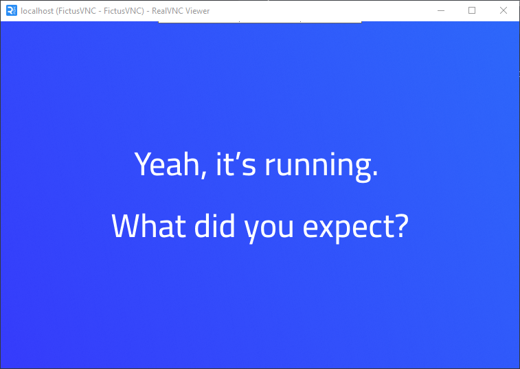

# FictusVNC Server

A minimal VNC server that serves a static image.


---
## July 8, 2025 Update
Shodan shadowbanned VNC services from their image feed (https://images.shodan.io/) and added official product recognition for FictusVNC: https://www.shodan.io/search?query=product:"FictusVNC"

Note: This affected ALL VNC services, not just FictusVNC.
Interestingly, it's now being classified as a honeypot - took them long enough to notice.

## ⚙️ Features

- 🖼 Serve static JPG & PNG as framebuffer
- 🖥 Supports RealVNC / UltraVNC / TightVNC clients
- 🛠 Configurable via `servers.toml`
- 📶 Multi-instance support (multiple ports/images)
- 💾 Cross-platform: Linux, Windows, macOS, ARM64
- 📉 Lightweight: ~2.8MB binary

---

## 🚀 Quick Start

- [▶️ Run without config](#run-without-config)
- [⚙️ Run with config (`servers.toml`)](#run-with-config)
- [🗂 Preview](#preview)

---

### ▶️ Run without config

```bash
./fictusvnc-linux-amd64 :5905 images/test.png
```

---

### ⚙️ Run with config

Create `servers.toml`:

```toml
[[server]]
listen = ":5900"
image = "default.png"
server_name = "My First Fake VNC"

[[server]]
listen = "127.0.0.1:5901"
image = "meme.png"
server_name = "Meme Server"
```

Then run:

```bash
./fictusvnc-linux-amd64
```

---

### 🗂 Preview



---

## Available Flags

| Flag              | Description                                      | Default Value    |
| ----------------- | ------------------------------------------------ | ---------------- |
| `--config`        | Path to TOML configuration file                  | `./servers.toml` |
| `--name`          | Default server name (if not specified in config) | `FictusVNC`      |
| `--no-brand`      | Disable "FictusVNC -" prefix in server name      | `false`          |
| `--version`, `-v` | Show version and exit                            | `false`          |
| `--show-ip`       | Display client IP on the image                   | `false`          |

---

## Example Run with Flags

```bash
go run . --config servers.toml --show-ip
```

---

## Configuration

Example TOML configuration file:

```toml
[[server]]
listen = "127.0.0.1"
start_port = 5900 # optional
end_port = 5910 # optional
server_name = "Test Server" # optional
image = "test.png"
```
Note: You can have multiple [[servers]] sections in one config file.
---

## License

This project is licensed under the terms specified in the [LICENSE](LICENSE) file.
